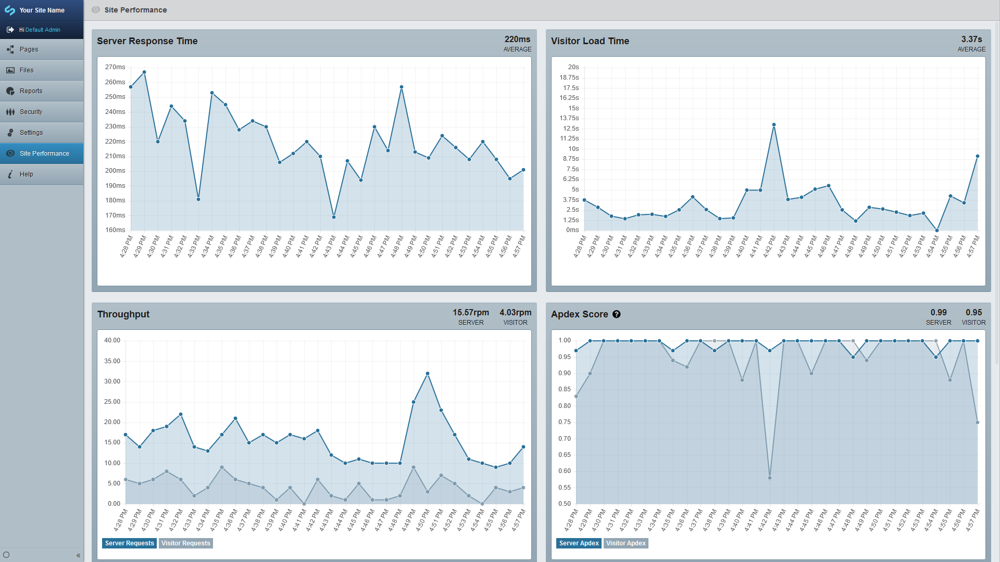

SilverStripe New Relic Integration
=================
Provides improved naming of transactions, error reporting and general tracking for SilverStripe site's on servers with the New Relic PHP Agent installed. It also surfaces an overview of information to the CMS such as Server Response Time, Visitor Load Time, Throughput, Apdex Score (Server and Visitor) as well as the Error Rate.

## Maintainer Contact
* Ed Chipman ([UndefinedOffset](https://github.com/UndefinedOffset))


## Requirements
* SilverStripe Framework 4.0+
* [New Relic for PHP](https://docs.newrelic.com/docs/agents/php-agent/getting-started/new-relic-php)


## Installation
__Composer (recommended):__
```
composer require webbuilders-group/silverstripe-new-relic
```


## Configuration
The configuration for the module can be found [here](docs/en/configuration.md) though most of the module will work out of the box provided the [New Relic PHP Agent](https://docs.newrelic.com/docs/agents/php-agent/getting-started/new-relic-php) and extension is loaded. In order to get the CMS "Site Performance" section working you must configure the ``WebbuildersGroup\NewRelic\Core\Admin\NewRelicPerformanceReport.application_id`` and ``WebbuildersGroup\NewRelic\Core\Admin\NewRelicPerformanceReport.api_key`` options.


## Admin Section
This module provices a high level overview for the CMS user of some of the less technical analytics that New Relic collects. Graphs displayed are the server response time, visitor load time, throughput (server and visitor), Apdex Score (server and visitor) and the server error rate. The interface uses visitor over browser for defining the client site performance to simplify it for CMS users. The data displayed is over a period of the last 30 minutes. The data refreshes every 5 minutes by default, see the [configuration documentation](docs/en/configuration.md) for more information. If you want to disable this section simply add the following to your _config.php.

```php
CMSMenu::remove_menu_item('WebbuildersGroup-NewRelic-Core-Admin-NewRelicPerformanceReport');
```


